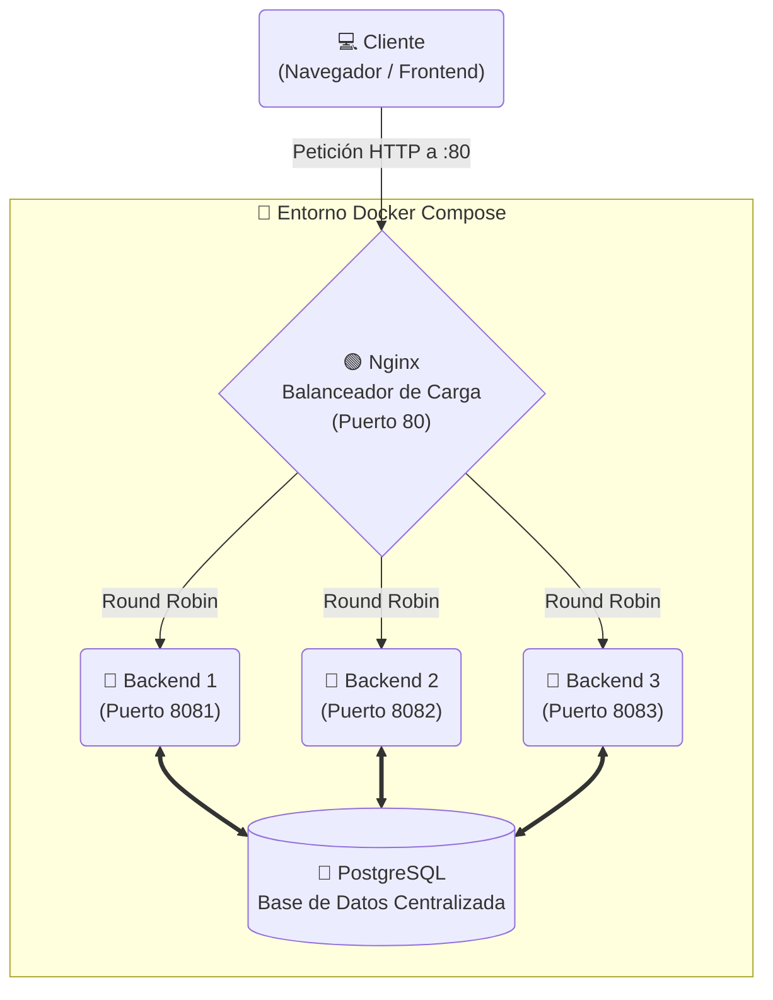

# 🚀 Arquitectura de Alta Disponibilidad: Load Balancer + Node.js + PostgreSQL


Este proyecto demuestra cómo implementar un sistema de **Alta Disponibilidad (HA)** distribuyendo el tráfico de red mediante un balanceador de carga utilizando el algoritmo **Round Robin**.

---

## 🏗️ Arquitectura Local (Docker Compose)

Implementamos un entorno contenerizado con múltiples réplicas de backend que se comunican con una base de datos centralizada.



### 🌟 Características Principales
1. **Balanceo de Carga:** Nginx distribuye las peticiones equitativamente entre los 3 contenedores de Node.js.
2. **Base de Datos Centralizada:** PostgreSQL almacena el estado global, resolviendo el problema de inconsistencia de datos (*statelessness*) entre réplicas.
3. **Frontend Premium:** Interfaz gráfica moderna con *Glassmorphism* para interactuar en tiempo real con la API y visualizar el balanceo.

---

## ☁️ Parte B: Despliegue en Google Cloud Platform (GCP)

El proyecto fue diseñado para escalar en entornos de nube reales utilizando **Compute Engine** y **Cloud Load Balancing**.

### 1️⃣ Infraestructura de Servidores
Se crearon dos máquinas virtuales (instancias) en zonas distintas para asegurar la redundancia geográfica:
- 🖥️ **web-server-1**: Ubicado en `us-central1-a`.
- 🖥️ **web-server-2**: Ubicado en `us-central1-b`.

### 2️⃣ Organización por Grupos de Instancias
- Se agruparon los servidores en *Unmanaged Instance Groups* (`web-servers-group-a` y `web-servers-group-b`).
- Esto permite al balanceador tratar a los servidores como unidades lógicas de procesamiento tolerantes a fallos.

### 3️⃣ Cloud Load Balancer Externo
Actúa como el **único punto de entrada** para los usuarios.
- **Frontend:** Define la IP pública y el puerto 80.
- **Backend Service:** Conecta los grupos de instancias, ejecuta comprobaciones de estado (*Health Checks*) y reparte el tráfico basándose en la utilización.

### 4️⃣ Pruebas de Funcionamiento
- ✅ **Balanceo Dinámico:** Las peticiones se alternan entre los servidores utilizando algoritmos como Round Robin.
- ✅ **Tolerancia a Fallos:** Si un proceso se detiene en un servidor, el balanceador redirige automáticamente el tráfico al servidor restante sin interrumpir el servicio.

---

## 🚀 Cómo ejecutar localmente

1. Clona este repositorio y entra a la carpeta `semana-07`.
2. Levanta los contenedores usando Docker Compose:
   ```bash
   docker compose up -d --build
   ```
3. Abre tu navegador y dirígete a `http://localhost` para interactuar con la aplicación.
